<!--
manual-meta
titulo: Manual técnico — PDV (Punto de Venta)
lead: Descripción funcional, arquitectura, requerimientos de instalación, diagramas UML y de base de datos, y guías de diagnóstico, mantenimiento y evolución.
actualizado: 2026-09-16
chips: Partes 1-33 mergeadas | Parte 34 pendiente | Backend 170 tests | Android 437 tests | Alembic 0001-0013 | Room v8
-->
# Manual técnico — PDV (Punto de Venta)

Documento de referencia para el equipo de *application management*: descripción
funcional, arquitectura, requerimientos de instalación, diagramas UML y de base
de datos, y guías de diagnóstico, mantenimiento y evolución.

- **Código de proyecto**: `POS` (Jira) / `PDV` (repo).
- **Estado a la fecha de este manual (2026-09-16)**: Partes 1-33 de
  `docs/PLAN.md` implementadas y mergeadas, incluyendo el motor de
  sincronización diferida (Parte 32) y este propio manual (Parte 33). Parte 34
  (primer release productivo) pendiente. App corriendo en dispositivo físico
  contra backend dockerizado en LAN.
- **Fuentes de verdad vivas** (este manual las resume, no las reemplaza):
  - `CLAUDE.md` — arquitectura estable, convenciones, comandos.
  - `docs/api-contract.md` — contrato de endpoints REST.
  - `docs/schema-pos.json` — esquema de datos compartido (Room + Alembic).
  - `docs/PLAN.md` — trabajo en curso (Parte 34 + Backlog).
  - `docs/PLAN-historico.md` — bitácora cerrada de las Partes 1-28.
  - `docs/review_code.md` — revisión de código del 2026-08-30 (origen de las
    Partes 21-30).
  - `docs/ALCANCE-DOCS.md` — manifiesto de alcance de este manual y de sus
    derivados HTML/PDF, mantenidos con `/docs-sync` ([§10.7](#107-comandos-slash-del-proyecto)).

---

## Índice

1. [Descripción funcional](#1-descripción-funcional)
2. [Arquitectura](#2-arquitectura)
3. [Modelo de datos (ER)](#3-modelo-de-datos-er)
4. [Diagramas UML](#4-diagramas-uml)
5. [Requerimientos e instalación](#5-requerimientos-e-instalación)
6. [Configuración](#6-configuración)
7. [Seguridad](#7-seguridad)
8. [Referencia de API](#8-referencia-de-api)
9. [Operación y diagnóstico](#9-operación-y-diagnóstico)
10. [Mantenimiento](#10-mantenimiento)
11. [Evolución y deuda técnica conocida](#11-evolución-y-deuda-técnica-conocida)
12. [Glosario](#12-glosario)

---

## 1. Descripción funcional

PDV es una aplicación de punto de venta para comercios con varias sucursales.
Funciona **completamente offline** (Kotlin + Room) y puede **sincronizarse**
de forma diferida con un backend FastAPI compartido entre sucursales. Incluye
un **asistente de IA opcional** (DeepSeek / OpenAI / OpenRouter) para consultas
y actualizaciones asistidas.

### 1.1 Módulos

| Módulo | Pantalla(s) | Qué hace | Persistencia |
|---|---|---|---|
| **Login / Sesión** | `LoginScreen`, `PanelConexionBottomSheet` | Autenticación por usuario/contraseña; panel de conexión accesible sin sesión (cambiar modo LOCAL/REMOTO, esquema/host/puerto, "Probar conexión"). | Sesión en memoria (`SessionManager`); conexión en DataStore. |
| **Venta de mostrador** | `VentaScreen` | Alta de venta con líneas, escaneo de código de barras (CameraX + ML Kit), método de pago efectivo/tarjeta, cálculo de cambio, ticket PDF e impresión. Decrementa inventario y genera movimiento de salida. | `ventas`, `venta_detalle`, `inventario`, `movimientos`. |
| **Entrada de mercancía** | `EntradaScreen` | Recepción de mercancía de artículo existente o alta de artículo nuevo. Incrementa inventario (delta aditivo) y genera movimiento de entrada. | `movimientos` (tipo `entrada`), `articulos`, `inventario`. |
| **Inventario** | `InventarioScreen`, `ImportarCatalogoScreen` | Consulta paginada con búsqueda (nombre/SKU/código de barras), ajuste de atributos de catálogo + existencia (genera movimiento de ajuste con delta), exportación CSV/Excel, importación de catálogo desde CSV. | `articulos`, `inventario`, `movimientos`. |
| **Caja** | `CajaScreen` | Cortes de caja parciales y finales, retiros de efectivo, cálculo de totales del periodo (ventas, efectivo, tarjeta, retiros, monto esperado), exportación por periodo. | `cortes_caja`, `retiros_efectivo`. |
| **Devoluciones** | `DevolucionScreen` | Registro de devolución de cliente con líneas (motivo, condición). No toca inventario (gestión con proveedor). | `devoluciones`, `devolucion_detalle`. |
| **Usuarios** | `UsuarioScreen` | CRUD de usuarios, asignación de rol, alta/cambio de contraseña (hash bcrypt calculado en el dispositivo). | `usuarios`. |
| **Roles** | `RolScreen` | CRUD de roles personalizados; `modulos_permitidos` activa/desactiva pantallas completas. Dos roles de sistema no editables (`administrador`, `encargado_turno`). | `roles`. |
| **Configuración** | `ConfiguracionScreen` | `BackendMode`, parámetros de conexión remota, sucursal seleccionada, activación y token del asistente de IA, prompt de sistema editable. En `LOCAL_CON_SINCRONIZACION`: sección "Sincronización" (última sync, pendientes, último error, botón "Sincronizar ahora") y confirmación de pendientes al cambiar de modo (Parte 32). | DataStore (preferencia de dispositivo); token cifrado con Android Keystore. |
| **Revisión de conflictos** | `RevisionConflictosScreen` | Panel **solo lectura** de `sync_conflicts`: lista los conflictos de sincronización detectados y su resolución automática. | `sync_conflicts`. |
| **Asistente de IA + FAQ** | `AsistenteIaWidget` (overlay flotante) | Chat con LLM; responde consultas, ejecuta acciones (alta de artículo, corte parcial, retiro, devolución, exportar/consultar inventario) por los **mismos repositorios** que las pantallas manuales, con confirmación explícita y chequeo de permiso. FAQ curado con retrieval de 3 niveles y atajos sin conexión (`qN`, match de texto). | Reutiliza los repositorios de dominio; FAQ empaquetado (`faq.jsonl`). |
| **Logs / Auditoría** | — (sin pantalla) | `AppLogger` escribe archivos `.txt` locales al dispositivo, una línea por evento con `[tipo][timestamp][sucursal][usuario] mensaje`. Categorías: `ERROR`, `WARN`, `INFO`, `DB_WRITE`, `SYNC_CONFLICT`, `AUTH`. Rotación a 5 MB, retención 30 días. | Sistema de archivos del dispositivo (`filesDir`). |

### 1.2 Modos de backend (`BackendMode`)

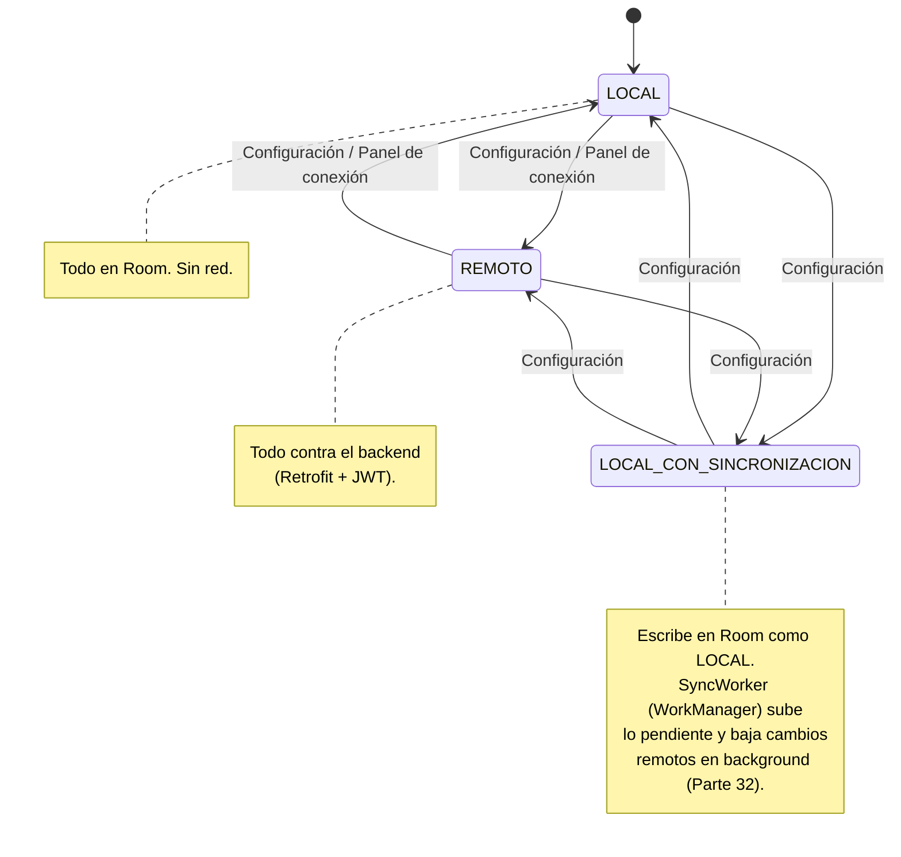

- **LOCAL**: la app opera 100% contra Room. No hay tráfico de red de negocio.
- **REMOTO**: cada operación va contra el backend por HTTP con
  `Authorization: Bearer <JWT>`. La respuesta del servidor es la fuente de verdad.
- **LOCAL_CON_SINCRONIZACION**: escribe en Room igual que LOCAL; el catálogo de
  sucursales se lee del backend en modo *best-effort* (degrada al catálogo local
  si falla). Un `SyncWorker` en background (periódico + botón "Sincronizar
  ahora") sube lo creado offline y baja los cambios remotos de entidades
  transaccionales, reusando la idempotencia por `local_id` de la Parte 23
  para no duplicar (detalle en [§2.4](#24-motor-de-sincronización)).

---

## 2. Arquitectura

### 2.1 Vista de contexto / despliegue

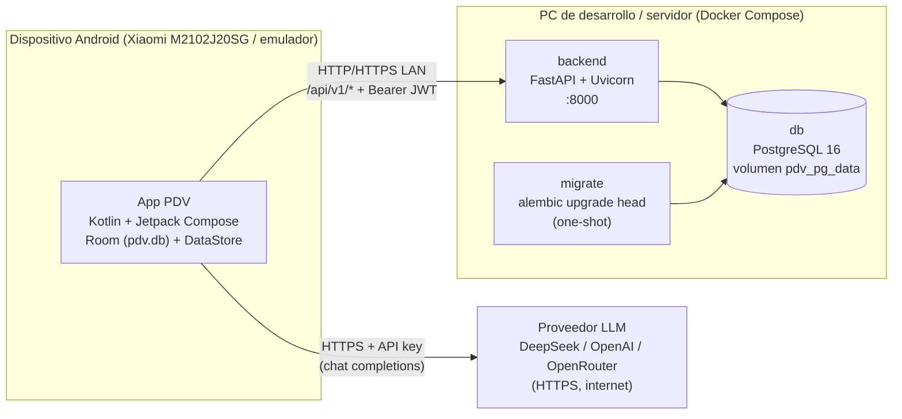

- El dispositivo alcanza el backend por **Wi-Fi en la misma subred** (IP LAN de
  la PC + puerto 8000) o, como alternativa, por **USB con `adb reverse`**
  (`localhost:8000`).
- El backend se publica en `0.0.0.0:8000` dentro del contenedor; el acceso
  desde otros equipos de la LAN requiere una regla de firewall inbound
  (ver [§5](#5-requerimientos-e-instalación)).
- El asistente de IA llama directo al proveedor LLM desde el dispositivo; el
  backend no interviene en ese camino.

### 2.2 App Android — capas

Arquitectura **MVVM + offline-first** con separación estricta
`domain / data.local / data.remote`. Paquete raíz `com.pdv.pos`.

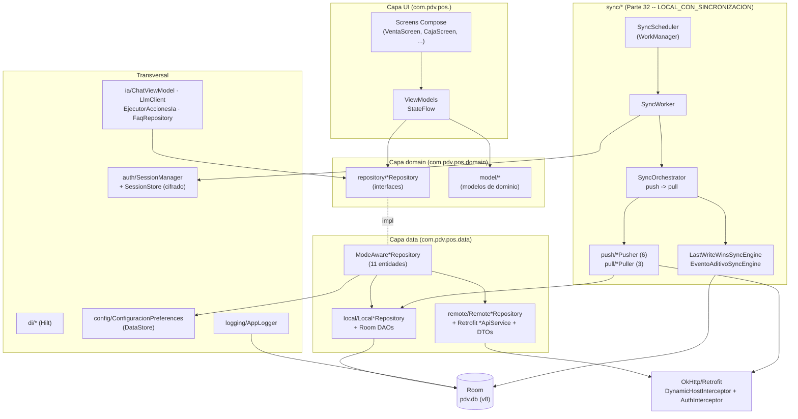

**Reglas de arquitectura (obligatorias, ver `CLAUDE.md` §3):**

1. `domain/` no conoce Room ni Retrofit: los ViewModels dependen solo de las
   interfaces `*Repository`.
2. `data/local/` **no importa nada de `data/remote/`**. El modo LOCAL debe
   compilar y funcionar aislado de la red.
3. La implementación inyectada de cada `*Repository` es siempre el
   `ModeAware*Repository`, que resuelve local vs. remoto leyendo `BackendMode`
   de DataStore en cada llamada.
4. Nunca se lanzan excepciones sin capturar desde la capa de red: se usa
   `ApiResult.Success/Error` o `Result<T>`.
5. `BackendMode`, parámetros de conexión y sucursal seleccionada son
   preferencia de dispositivo y viven en DataStore, **sin Room** (excepción
   documentada). El catálogo de sucursales sí sigue el patrón repositorio/Room.

**Patrón `ModeAware*` (ejemplo real, `ModeAwareVentaRepository`):**

```kotlin
override suspend fun registrarVenta(venta: Venta) {
    when (preferences.deviceConfig.first().backendMode) {
        BackendMode.LOCAL, BackendMode.LOCAL_CON_SINCRONIZACION -> local.registrarVenta(venta)
        BackendMode.REMOTO -> remote.registrarVenta(venta)
    }
    inventarioRefreshSignal.emitir()
}
```

**Stack Android** (`android/gradle/libs.versions.toml`):

| Área | Tecnología | Versión |
|---|---|---|
| Lenguaje / build | Kotlin / AGP / KSP | 2.2.21 / 8.13.2 / 2.2.21-2.0.5 |
| SDK | compileSdk / targetSdk / minSdk | 36 / 36 / 26 (Android 8.0) |
| UI | Jetpack Compose BOM · Material3 · Navigation-Compose | 2026.06.01 · — · 2.9.6 |
| DI | Hilt | 2.57.2 |
| Sync en background | WorkManager · Hilt-Work (Parte 32) | 2.10.1 · 1.2.0 |
| Red | Retrofit · OkHttp · kotlinx.serialization | 3.0.0 · 5.4.0 · 1.11.0 |
| Persistencia local | Room · DataStore Preferences | 2.8.4 · 1.2.1 |
| Escaneo | CameraX · ML Kit barcode-scanning | 1.6.1 · 17.3.0 |
| Cripto | bcrypt (at.favre.lib) | 0.10.2 |
| Test | JUnit5 · MockK · kotlinx-coroutines-test · OkHttp MockWebServer | 6.1.3 · 1.14.11 · 1.11.0 · 5.4.0 |
| JVM target | 17 | |

### 2.3 Backend FastAPI — capas

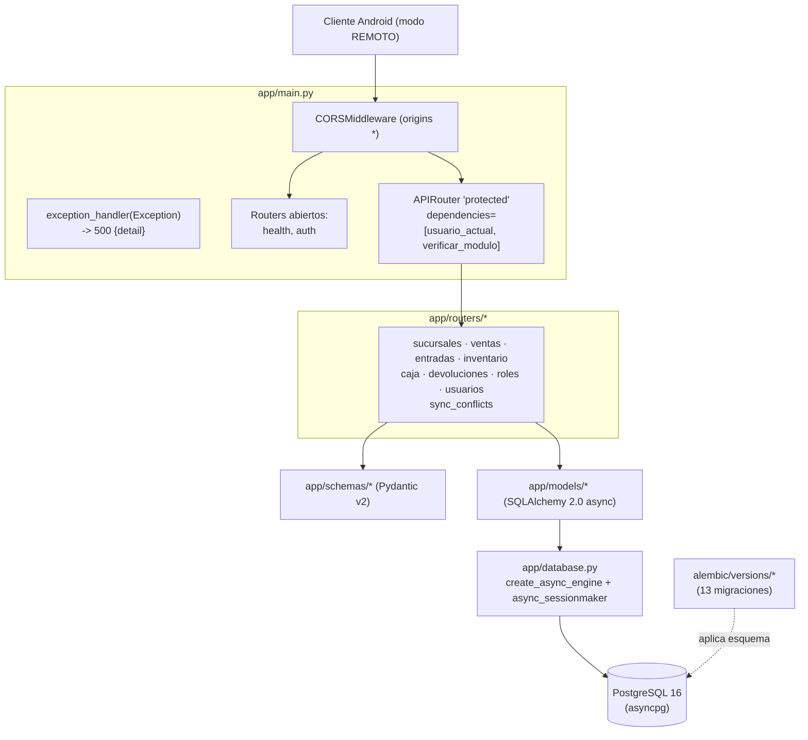

- **Autenticación y autorización** se declaran **una sola vez** a nivel del
  router `protected` (`app/main.py`): `Depends(usuario_actual)` valida el JWT y
  carga el `Usuario` (con su `rol` vía `selectinload`); `Depends(verificar_modulo)`
  aplica el chequeo de módulo a las escrituras.
- `health` y `auth` quedan fuera del router protegido (rutas abiertas).
- El `exception_handler` global convierte cualquier excepción no prevista en
  `500 {"detail": "error interno del servidor"}` y la loguea a nivel `ERROR`
  (sin traceback al cliente). No intercepta `HTTPException` ni `422`.
- **Sin ORM como response_model**: los routers devuelven esquemas Pydantic de
  `app/schemas/`.
- **Montos y cantidades** viajan como *string JSON* en el contrato para no
  perder precisión decimal; en Postgres son `Numeric(12,2)` / `Numeric(14,3)`.

**Stack backend** (`backend/pyproject.toml`, `uv.lock`):

| Área | Tecnología | Versión |
|---|---|---|
| Runtime | Python | >=3.11 (3.11.15 gestionado por uv) |
| Framework | FastAPI · Uvicorn[standard] | 0.141.1 · 0.52.4 |
| ORM / migraciones | SQLAlchemy 2.0 (async) · Alembic | 2.0.52 · 1.19.1 |
| Driver DB | asyncpg | 0.31.0 |
| Cripto / auth | bcrypt · PyJWT | 5.0.0 · 2.13.0 |
| Gestor de dependencias | uv | 0.10.12 |
| Test | pytest · pytest-asyncio · httpx | 9.1.1 · 1.4.0 · 0.28.1 |
| Base de datos | PostgreSQL | 16 |

### 2.4 Motor de sincronización

Diseño *last-write-wins* + eventos aditivos (`android/.../sync/`,
`docs/PLAN.md` Parte 6, `docs/api-contract.md` §12).

- **Entidades sin ambigüedad de cantidad** (precios, usuarios, roles,
  sucursales): `LastWriteWinsResolver` compara `updated_at`; gana el más
  reciente.
- **Entidades de cantidad/movimiento** (inventario, ventas, cortes, devoluciones):
  `EventoAditivoCombiner.combinar(base, deltaLocal, deltaRemoto)` — nunca un
  `UPDATE cantidad = X` directo, siempre suma de deltas con signo. El backend
  aplica el mismo principio (`inventario.cantidad = cantidad_actual ± delta`,
  con `with_for_update()` para evitar carreras).
- **Auditoría**: toda divergencia de `updated_at` se registra en
  `sync_conflicts` (aunque se resuelva automáticamente) y se loguea con
  `LogType.SYNC_CONFLICT`.
- **Idempotencia de los POST de sync** (Parte 23 + gap 1 de la Parte 32):
  `ventas`, `movimientos` (entradas), `cortes_caja`, `retiros_efectivo` y
  `devoluciones` tienen `UNIQUE(local_id)`; el router hace `flush()`, captura
  `IntegrityError`, hace `rollback` y devuelve `200` con la fila ya persistida
  en vez de duplicar. `sync_conflicts` es idempotente por su `id` generado en
  el dispositivo.
- **Orquestación del push/pull en background** (`android/.../sync/push/`,
  `sync/pull/`, Parte 32): `SyncScheduler` encola un `SyncWorker`
  (`CoroutineWorker` + Hilt) periódico (~15 min, con `Constraints` de
  conectividad y backoff exponencial) más un `OneTimeWorkRequest` desde el
  botón "Sincronizar ahora" de Configuración — ambos no-op salvo
  `BackendMode == LOCAL_CON_SINCRONIZACION`. `DefaultSyncOrchestrator` corre
  primero el **push**, un `EntityPusher` por entidad, en el orden
  entradas → ventas → ajustes de inventario → cortes → retiros →
  devoluciones (para que los artículos/ventas creados offline ya tengan
  `remote_id` cuando otra fila los referencia), y luego el **pull**
  (`EntityPuller` de `inventario` / `cortes_caja` / `retiros_efectivo`,
  acotado a la sucursal seleccionada, con el cursor `?updated_since=` que
  persiste `SyncStateStore` y avanza al `max(updated_at)` recibido).
- **Política de errores del push**: `IOException`/`5xx` reintentan el ciclo
  completo; `401` corta el ciclo y marca la sesión expirada; un `4xx` no-401
  en una fila puntual la descarta (`isSynced = true` sin `remote_id`, para no
  reintentarla en cada ciclo) salvo que la causa sea un id local aún sin
  resolver a remoto (ventas/devoluciones con líneas), en cuyo caso la fila se
  **aplaza** al próximo ciclo en lugar de descartarse.
- **Autenticación del worker desatendido**: `SessionStore` persiste la sesión
  (incluido el `accessToken`) cifrada con `TokenCipher`/Android Keystore
  (mismo patrón que el token de IA, Parte 14) y siembra `SessionManager` al
  arrancar el proceso, para que el `SyncWorker` pueda adjuntar
  `Authorization: Bearer` tras un reinicio sin que haya sesión interactiva.
- **Estado actual**: motor, orquestación y resolución de conflictos existen,
  están probados (`jvm-tests` con fakes, sin Robolectric) y **verificados de
  punta a punta en el Xiaomi** (push, pull cross-terminal y cambio de modo
  con confirmación de pendientes). Follow-ups conocidos en
  [§11.3](#113-seguimiento-del-motor-de-sync-parte-32).

---

## 3. Modelo de datos (ER)

Fuente de verdad: `docs/schema-pos.json`. La compuerta `schema-parity` exige
que el JSON, la entidad Room y la migración Alembic queden alineados entre sí.

### 3.1 Campos comunes

- **Tracking de sincronización** (toda tabla salvo `sync_conflicts`):
  `local_id` (uuid, PK local en Room), `remote_id` (uuid, nulo hasta el primer
  push; en el backend es la PK `id`), `updated_at` (ISO-8601 UTC),
  `is_synced` (bool), `deleted_at` (soft-delete; **nunca DELETE físico**).
- **`sucursal_id`** (uuid, FK a `sucursales`): presente en toda entidad
  transaccional (`sucursal_scoped`): `inventario`, `ventas`, `cortes_caja`,
  `retiros_efectivo`, `devoluciones`, `movimientos`, `sync_conflicts`.
  **No** lo llevan `articulos`, `roles`, `usuarios` (globales entre sucursales).
- **Seed**: si no existe ninguna fila en `sucursales` al arrancar, se crea
  "Sucursal principal" (backend: migración inicial; Android LOCAL: primer
  arranque).

### 3.2 Diagrama entidad-relación

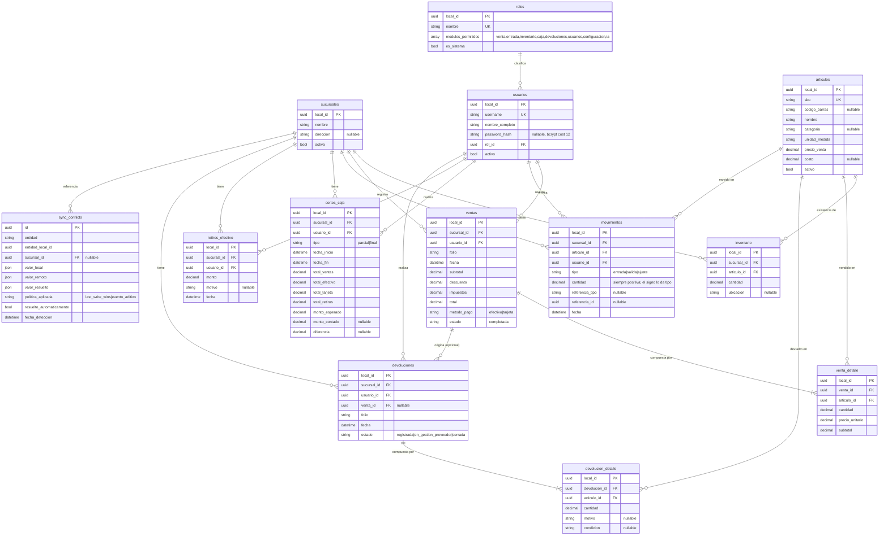

### 3.3 Notas de integridad

- `venta_detalle` **no tiene FK real** a `articulos` (decisión de la Parte 8);
  `inventario`, `movimientos`, `devolucion_detalle` **sí** la tienen.
- `retiros_efectivo` **no tiene FK** a `cortes_caja`: se asocian por rango de
  fecha del lado del dispositivo.
- `sync_conflicts` no participa del ciclo `local_id/remote_id/is_synced/deleted_at`:
  es el propio registro de auditoría; no se borra (no hay `DELETE`).
- Backend: `ventas`, `movimientos`, `cortes_caja` y `retiros_efectivo` tienen
  `local_id UNIQUE` desde la Parte 23 (migración `0012`); `devoluciones` lo
  suma en la Parte 32 (migración `0013`, gap 1 de esa Parte) porque su push
  diferido también lo necesita. En `movimientos` solo las entradas llevan
  `local_id`; las filas de venta/ajuste lo dejan nulo (`UNIQUE` permite
  múltiples `NULL`).

### 3.4 Room (dispositivo)

- Base `pdv.db`, `@Database(version = 8, exportSchema = true)`, 13 entidades,
  10 DAOs (`PdvDatabase`). Esquemas exportados en `android/app/schemas/`.
- `Converters` (TypeConverters): `BigDecimal <-> String` (`toPlainString`),
  `List<modulo> <-> String` con separador U+001F (Unit Separator).
- `inventario.cantidadNum` (REAL) es columna espejo de `cantidad` (TEXT) para
  poder `SUM()`/`ORDER BY` numérico en SQL (M-9, migración Room `MIGRATION_7_8`).
  Toda escritura de `cantidad` debe pasar por `nuevoInventario(...)` /
  `InventarioEntity.conCantidad(...)` para no desincronizar las dos columnas.
- Migraciones registradas en `DatabaseModule` (`addMigrations(MIGRATION_7_8)`);
  la v7 es la línea base con `exportSchema` (Parte 24).

---

## 4. Diagramas UML

### 4.1 Componentes (visión conjunta)

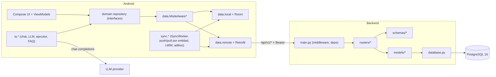

### 4.2 Clases — patrón repositorio `ModeAware` (representativo)

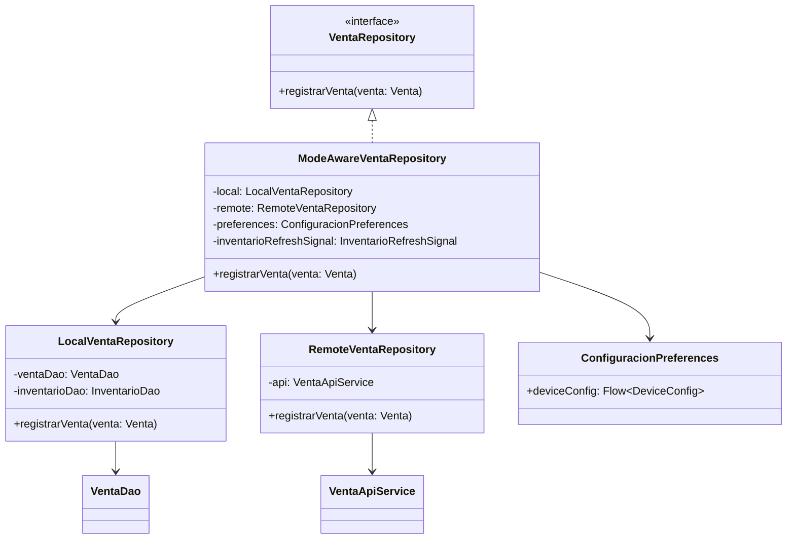

El mismo patrón se repite en las 11 entidades: `Sucursal`, `Venta`, `Entrada`,
`Inventario`, `Caja`, `RetiroEfectivo`, `Devolucion`, `Usuario`, `Rol`,
`SyncConflict`, `Auth` (todas cableadas en `di/RepositoryModule`).

### 4.3 Secuencia — login en modo REMOTO

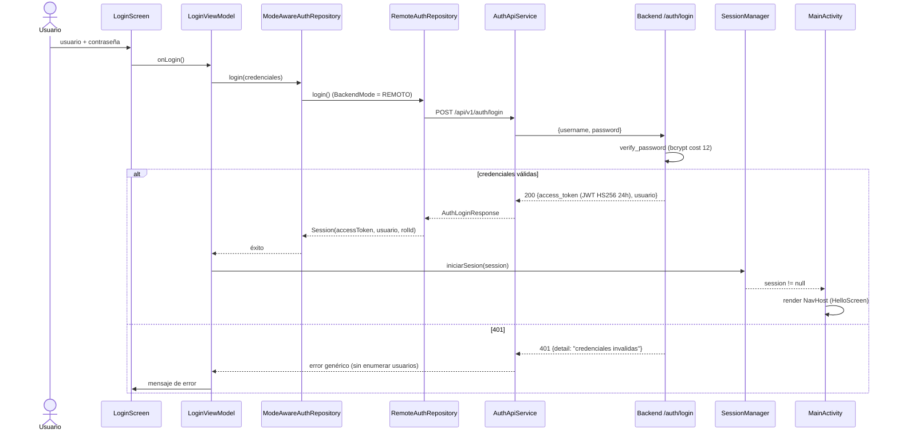

En **modo LOCAL** la rama equivalente va a `LocalAuthRepository`, que valida
contra `usuarios`/`roles` en Room (bcrypt en `Dispatchers.Default`); la sesión
resultante no tiene `accessToken`.

### 4.4 Secuencia — venta en modo REMOTO (con idempotencia y decremento de stock)

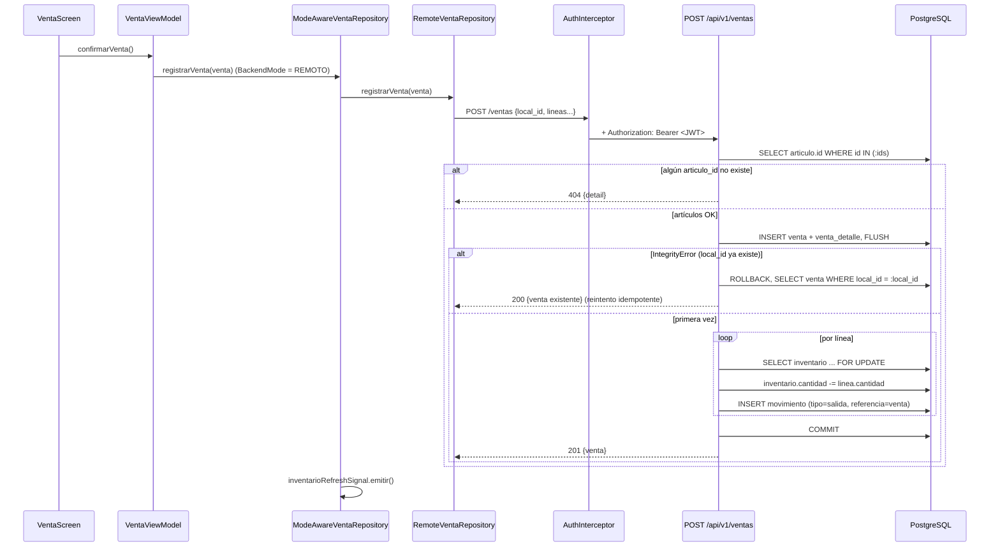

En **modo LOCAL** la operación equivalente ocurre en una transacción Room
(`LocalVentaRepository`): inserta `venta` + `venta_detalle`, decrementa
`inventario`, inserta `movimiento`, todo con `isSynced = false`.

### 4.5 Secuencia — resolución de conflicto de sincronización

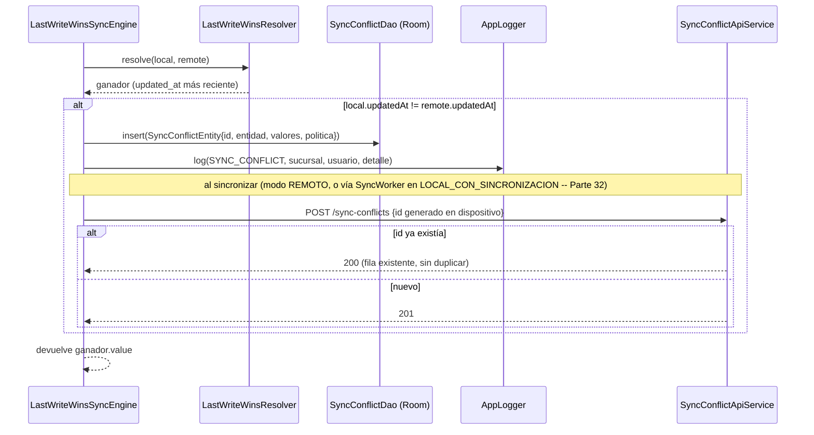

### 4.6 Secuencia — acción del asistente de IA

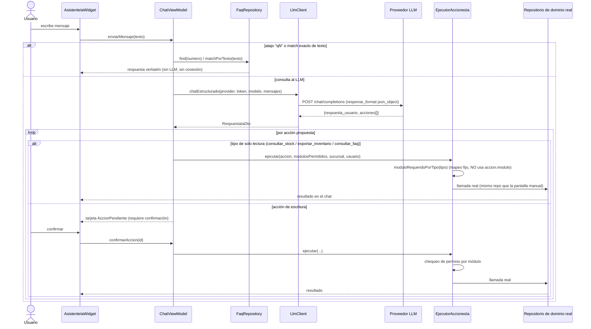

**Seguridad de la IA**: el módulo que autoriza cada acción se deriva **siempre**
de `accion.tipo` (mapa fijo en `EjecutorAccionesIa.moduloRequeridoPorTipo`),
nunca del campo `accion.modulo`, porque ambos vienen de la misma fuente no
confiable (la salida del LLM). Las 4 acciones de escritura exigen confirmación
explícita del usuario en la UI antes de ejecutarse.

### 4.7 Despliegue (Docker Compose)

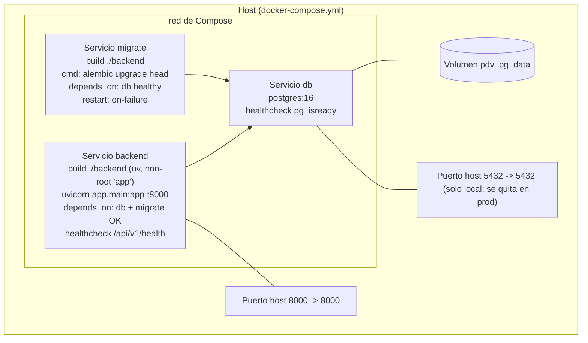

---

## 5. Requerimientos e instalación

### 5.1 Backend — vía Docker (recomendado)

**Requisitos**: Docker + Docker Compose.

```bash
# Windows
scripts/start-windows.ps1     # docker compose up -d --build
scripts/stop-windows.ps1

# Mac
scripts/start-mac.sh
scripts/stop-mac.sh

# Linux
scripts/start-linux.sh
scripts/stop-linux.sh
```

- Backend disponible en `http://localhost:8000`; health en
  `GET /api/v1/health` -> `{"status":"ok","version":"0.1.0"}`.
- El servicio `migrate` aplica todas las migraciones Alembic antes de que
  arranque `backend`.
- **Rebuild obligatorio tras cambiar código de `backend/app/`**: el `Dockerfile`
  hornea el fuente (`COPY app ./app`); no hay volumen ni `--reload`. Volver a
  correr `start-*` (que hace `up -d --build`) es suficiente. `uv run pytest`
  corre contra el host, **no** contra el contenedor: verde en pytest no implica
  contenedor actualizado.

### 5.2 Backend — manual (iteración rápida en debug)

**Requisitos**: Python 3.11+, `uv` (0.10.12+), un PostgreSQL alcanzable.

```bash
cd backend
uv sync                                 # crea .venv desde uv.lock (incluye grupo dev)
uv run uvicorn app.main:app --reload
uv run alembic upgrade head
uv run pytest
uv run alembic check                    # detecta drift modelo <-> migraciones
```

`backend/requirements.txt` es un **export generado** (`uv export`) que se
mantiene solo por compatibilidad externa; no lo consumen ni el `Dockerfile` ni
el CI, y no se edita a mano.

### 5.3 Android

**Requisitos**:
- Android Studio (o SDK de línea de comandos) con **compileSdk 36**, **JDK 17**.
- Dispositivo físico con **Android 8.0+ (API 26)** — objetivo de pruebas:
  **Xiaomi M2102J20SG** — o emulador de fallback.
- Permisos en runtime: `CAMERA` (escaneo de código de barras), `RECORD_AUDIO`
  (entrada por voz del asistente).

```bash
cd android
./gradlew assembleDebug          # genera pos-hello-debug-v0.1.apk
./gradlew installDebug           # instala en el dispositivo/emulador conectado
./gradlew testDebugUnitTest      # tests unitarios JVM
./gradlew lint
```

**"Definición de hecho" para cambios en `android/`**: no basta con compilar o
pasar revisión textual; debe quedar instalado y verificado corriendo en el
dispositivo físico (o el emulador de fallback).

#### 5.3.1 Hardware y espacio del dispositivo

El proyecto no declara un piso formal de hardware más allá de `minSdk 26`.
Los valores de abajo son mínimos prácticos derivados del stack (Jetpack
Compose + CameraX + modelo TFLite de ML Kit en el mismo proceso) y de medir
los APK ya compilados.

| Recurso | Mínimo | Recomendado | Notas |
|---|---|---|---|
| SO | Android 8.0 (API 26) | Android 11+ | Validado en Xiaomi M2102J20SG (Redmi Note 10S). |
| CPU / ABI | `armeabi-v7a` (ARM 32-bit) | `arm64-v8a` (ARM 64-bit) | El APK empaqueta las 4 ABIs; en la instalación solo se extrae la nativa de la ABI del dispositivo. |
| RAM | ~2 GB | 3-4 GB | Sin floor declarado. Compose, la vista previa de cámara y el modelo de barcode corren en proceso. |
| Cámara trasera con autofoco | opcional | sí | `uses-feature android:required="false"`: la app instala sin cámara, pero el escaneo de código de barras queda inhabilitado. |
| Micrófono | opcional | — | Solo para la entrada por voz del asistente de IA. |
| Pantalla | teléfono táctil, vertical | — | Diseño Compose pensado para portrait. |
| Red | ninguna en modo LOCAL | Wi-Fi | Wi-Fi en la misma subred para modo REMOTO / sync. Internet solo para el asistente de IA. |

**Tamaño de los artefactos actuales** (build sin R8, sin ofuscación, sin App
Bundle ni ABI splits):

- APK debug: **41,6 MB**. APK release sin firmar: **36,2 MB**.
- DEX (multidex, 17 archivos): ~45 MB sin comprimir en debug — grande porque
  `isMinifyEnabled = false` (se reduce en la Parte 34).
- Nativas de ML Kit barcode (`libbarhopper_v3.so`): ~4,8 MB para la ABI
  `arm64-v8a` + ~0,9 MB de modelos `.tflite` empaquetados (sin descarga en
  runtime).

**Espacio en el dispositivo:**

| Concepto | Estimación | Comentario |
|---|---|---|
| Instalación de la app | ~90-160 MB | APK almacenado + librería nativa de la ABI extraída + artefactos AOT de ART (oat/vdex). **Reservar >= 250 MB libres.** |
| `pdv.db` (Room) | Catálogo de miles de artículos ~ pocos MB; ~1-2 KB por venta (venta + líneas + movimientos + ajuste de inventario) -> 10 000 ventas ~ 15-25 MB | **Sin purga automática** (todo es soft-delete). Un dispositivo con años de operación offline necesita una estrategia de archivado/depuración. |
| Logs (`AppLogger`) | Pocos MB típico; decenas de MB con logging intenso | Archivos `app-log-*.txt` de 5 MB máx.; se purgan los de más de 30 días. No hay tope de tamaño total, solo retención temporal. |
| Tickets PDF y exportaciones CSV/Excel | Pequeño (ticket pocos KB; export escala con el catálogo) | Van a `cacheDir/exports/`. Son cache: el SO puede evictarlos bajo presión de almacenamiento; la app no los borra por su cuenta. |

La Parte 34 (`isMinifyEnabled` + `isShrinkResources` + AAB / ABI splits)
reduciría de forma notable el tamaño de descarga e instalación.

### 5.4 Conectividad dispositivo físico -> backend

**Camino principal — Wi-Fi en la misma subred:**
1. Teléfono y PC en la misma red Wi-Fi.
2. En la app: panel de conexión (login o Configuración) -> modo **REMOTO**,
   esquema `http`, IP = IP LAN de la PC (`ipconfig` -> "Dirección IPv4"),
   puerto `8000`.
3. Regla de firewall de Windows (una sola vez, PowerShell admin):
   ```powershell
   New-NetFirewallRule -DisplayName "PDV backend 8000" -Direction Inbound -Protocol TCP -LocalPort 8000 -Action Allow
   ```
4. Si el router aísla clientes Wi-Fi ("AP/client isolation"), desactivarlo.
5. La IP LAN es DHCP y puede cambiar entre reinicios: reservarla (DHCP estático)
   o fijar IP estática en la PC.

**Alternativa — túnel USB (`adb reverse`):** IP `localhost:8000` en la app y en
la PC:
```powershell
scripts\install-apk-tuneling.ps1   # installDebug + adb reverse tcp:8000 tcp:8000
scripts\stop-apk-services.ps1
```
El túnel **no persiste** entre reconexiones de cable, reinicios ni
`adb kill-server`; hay que rehacerlo cada sesión.

**Cleartext HTTP**: habilitado solo en el build de **debug**
(`app/src/debug/res/xml/network_security_config.xml`, `base-config`). El build
de release bloquea cleartext por defecto (endurecimiento formal: Parte 34).

### 5.5 Asistente de IA (opcional)

- En Configuración: activar IA, elegir proveedor (`DEEP_SEEK` / `OPEN_AI` /
  `OPEN_ROUTER`), pegar el **API key del proveedor** y opcionalmente el modelo.
- El token se cifra con AES-256 respaldado por Android Keystore; en DataStore
  solo se guarda ciphertext + IV (`AndroidKeystoreTokenCipher`).
- El asistente llama directo al proveedor por HTTPS; no pasa por el backend.

### 5.6 Secretos y despliegue no-local

- `docker-compose.yml` usa defaults solo-local (`pdv`/`pdv`, `JWT_SECRET_KEY`
  de desarrollo) vía `${VAR:-default}`.
- Para cualquier entorno no-local: copiar `docker-compose.prod.yml.example` a
  `docker-compose.prod.yml` (gitignoreado) con `JWT_SECRET_KEY` fuerte y
  credenciales reales de Postgres, y levantar con
  `docker compose -f docker-compose.yml -f docker-compose.prod.yml up -d --build`.
- El destino de despliegue productivo (Render / Fly.io / VPS / AWS) está
  **sin decidir** (`CLAUDE.md` §7 `[TODO]`; se resuelve en la Parte 34).

---

## 6. Configuración

### 6.1 Backend — variables de entorno

| Variable | Default | Uso |
|---|---|---|
| `DATABASE_URL` | `postgresql+asyncpg://pdv:pdv@db:5432/pdv` | Conexión async a Postgres (`app/database.py`, `alembic/env.py`). |
| `JWT_SECRET_KEY` | `dev-secret-key-cambiar-en-produccion` | Firma HS256 de los JWT (`app/security.py`). **Cambiar antes de exponer fuera de la LAN.** |

Parámetros fijos en código (`app/security.py`): `JWT_ALGORITHM = "HS256"`,
`JWT_EXPIRES_MINUTES = 60*24` (24 h), bcrypt `rounds=12`.

### 6.2 Android — DataStore (`configuracion`)

`ConfiguracionPreferences` sobre DataStore Preferences (sin Room). Claves:

| Clave | Tipo | Descripción |
|---|---|---|
| `backend_mode` | `LOCAL` / `REMOTO` / `LOCAL_CON_SINCRONIZACION` | Modo activo. Default `LOCAL`. |
| `esquema` | `HTTP` / `HTTPS` | Esquema de la conexión remota (`EsquemaConexion`). Default `HTTP`. |
| `ip` | String | Host del backend remoto. |
| `puerto` | String | Puerto del backend remoto. |
| `sucursal_id_seleccionada` | String? | Sucursal activa del dispositivo. |

Otras preferencias: `IaPreferences` (activo, proveedor, modelo, token cifrado),
`PromptIaPreferences` (prompt de sistema editable), `SyncStateStore` (Parte
32: `lastSuccessAtMillis`, `lastError`, cursor `updated_since` por entidad del
pull), `SessionStore` (Parte 32: sesión del usuario para el `SyncWorker`
desatendido, `accessToken` cifrado igual que el token de IA).

`DynamicHostInterceptor` cachea `DeviceConfig` en un campo `@Volatile` (sembrado
una vez de forma bloqueante, mantenido por un colector) y reescribe
esquema/host/puerto de cada request; si no hay IP o el puerto no es numérico,
deja pasar la request con el `BASE_URL` por defecto
(`http://localhost:8000/api/v1/`).

### 6.3 Versionado de la app

- `versionName` SemVer `MAJOR.MINOR.PATCH` (cadena legible del alcance
  publicado; se sube a mano en el commit de release).
- `versionCode = MAJOR*10000 + MINOR*100 + PATCH` (entero monotónico, sin
  colisiones entre APKs distribuidos).
- Hoy: `versionCode = 1` / `versionName = "0.1"` hasta el primer release.

---

## 7. Seguridad

| Aspecto | Implementación |
|---|---|
| **Contraseñas** | bcrypt cost 12 en ambos lados. El hash se calcula **siempre en el dispositivo Android** que recibe el texto plano; el endpoint de usuarios recibe `password_hash` ya calculado y nunca devuelve el hash. |
| **Tokens** | JWT `HS256`, `sub` = `usuario.id`, expiración 24 h, firmado con `JWT_SECRET_KEY`. Sin `refresh_token` (diferido: la sesión no se persiste, se re-loguea en cada arranque). |
| **Enforcement backend** | `Depends(usuario_actual)` en el router `protected`: valida firma/expiración y que el `sub` corresponda a un usuario existente, activo y no borrado. `401 {"detail": "token invalido o expirado"}` genérico. `health` y `auth` exentos. |
| **Autorización por módulo** | `verificar_modulo` gatea **solo escrituras** (`POST`/`PATCH`/`DELETE`) según `(método, ruta)` -> módulo requerido (mapa en `app/permissions.py`). Los `GET` solo exigen token válido. `403 {"detail": "el rol no tiene permiso para el modulo: X"}`. |
| **Reacción del cliente a 401** | `AuthInterceptor` cierra la sesión y vuelve a `LoginScreen` **solo si** la request llevaba token (`token != null`) y no era `/auth/login`. Un 401 a una request sin token (esperado en LOCAL / LOCAL_CON_SINCRONIZACION contra un backend con enforcement) lo maneja el repositorio que llamó. |
| **No enumeración de usuarios** | `/auth/login` devuelve el mismo 401 para usuario inexistente, inactivo, sin hash o contraseña incorrecta. |
| **Token de IA** | Cifrado AES-256 con clave respaldada por Android Keystore; solo ciphertext + IV en DataStore. El token viaja únicamente en el header del request al proveedor, nunca se loguea. |
| **Autorización de acciones de IA** | El módulo a autorizar se deriva del `tipo` de acción (mapa fijo), nunca del campo `modulo` de la salida del LLM. Confirmación explícita del usuario para las 4 acciones de escritura. |
| **CORS** | `CORSMiddleware` con `allow_origins=["*"]` (no hay cliente web; revisar el día que exista uno). Los `500` del handler global **no llevan headers CORS** (posición de `ServerErrorMiddleware` en el stack de Starlette). |
| **Contenedor** | Corre como usuario no privilegiado `app` (`adduser --system` + `USER app` en el `Dockerfile`). |
| **Logging de auditoría** | `AppLogger` (dispositivo): categoría `AUTH` para logins y rechazos de permiso de la IA; `SYNC_CONFLICT` para conflictos. Archivos `.txt` locales, nunca viajan por API. Backend: logging operativo a stdout/stderr, nivel `ERROR` en el handler global. |

**Pendientes de seguridad para producción (Parte 34):** APK firmado (hoy
`assembleRelease` produce un APK sin firmar), `JWT_SECRET_KEY` fuerte en el
entorno desplegado, backend por HTTPS, cleartext deshabilitado en release,
R8/ofuscación (B-7, diferido).

---

## 8. Referencia de API

Base URL dev: `http://localhost:8000/api/v1`. Detalle completo (bodies,
códigos de error, ejemplos): `docs/api-contract.md`.

| Método | Ruta | Módulo (escritura) | Notas |
|---|---|---|---|
| GET | `/health` | — (exenta) | Liveness. |
| POST | `/auth/login` | — (exenta) | Devuelve JWT + usuario. |
| GET / POST | `/sucursales` | `configuracion` (POST) | Paginado. |
| GET / POST | `/sync-conflicts` | — (infraestructura) | POST idempotente por `id` del dispositivo. |
| POST | `/ventas` | `venta` | Idempotente por `local_id`. Decrementa inventario + movimiento. |
| POST | `/entradas` | `entrada` | Idempotente por `local_id`. Alta de artículo + inventario + movimiento en una llamada atómica. |
| GET | `/inventario` | — | `sucursal_id` requerido; `q` filtra nombre/SKU/código; `updated_since` para el pull del sync diferido (Parte 32). |
| PATCH | `/inventario/{articulo_id}` | `inventario` | `cantidad` = nuevo valor; el server aplica el delta con signo. |
| GET | `/inventario/ubicaciones` | — | Valores usados. |
| GET | `/articulos/categorias`, `/articulos/unidades-medida` | — | Valores usados (sin tabla de catálogo). |
| POST / GET | `/cortes-caja` | `caja` (POST) | Idempotente por `local_id`. Filtros `desde`/`hasta`/`updated_since` (este último para el pull del sync diferido). |
| GET | `/cortes-caja/totales` | — | Agrega ventas/retiros del periodo. |
| POST / GET | `/retiros-efectivo` | `caja` (POST) | Idempotente por `local_id`. Filtros `desde`/`hasta`/`updated_since` (pull del sync diferido). |
| POST | `/devoluciones` | `devoluciones` | Con líneas. No toca inventario. Idempotente por `local_id` (Parte 32). |
| GET / POST / PATCH / DELETE | `/roles` | `usuarios` (escrituras) | Roles de sistema: `400` a PATCH/DELETE. DELETE = soft-delete. |
| GET / POST / PATCH / DELETE | `/usuarios` | `usuarios` (escrituras) | Nunca devuelve `password_hash`. DELETE = soft-delete. |

**Convenciones**: fechas ISO-8601 UTC; IDs UUID v4 (string); paginación
`page` (1-indexed) + `page_size` (default 20, max 100); errores de negocio
`{ "detail": "..." }`; errores de validación con el shape estándar de
FastAPI/Pydantic (`422`).

**Al cambiar un endpoint**: actualizar primero `docs/api-contract.md`, luego el
backend (schema + router + modelo + migración si aplica), luego el cliente
Kotlin (DTO + ApiService + Remote*Repository). Existe una skill `sync-api-contract`
para guiar el proceso.

---

## 9. Operación y diagnóstico

### 9.1 Health y estado

| Qué | Cómo |
|---|---|
| Backend vivo | `curl http://<host>:8000/api/v1/health` -> `{"status":"ok","version":"0.1.0"}`. |
| Contenedores | `docker compose ps` (backend `healthy`, `migrate` `exited 0`). |
| Migraciones aplicadas | `docker compose exec backend alembic current` (debe coincidir con el head del repo, hoy `0013`). |
| Prueba de conexión desde la app | Panel de conexión -> "Probar conexión" (`BackendHealthChecker`, OkHttp propio sin interceptores, contra la URL tecleada). |

### 9.2 Logs del backend

- Módulo `logging` estándar, **nunca `print()`**. Salida a stdout/stderr; el
  contenedor la captura (`docker compose logs -f backend`). Sin archivos ni
  rotación propios.
- Nivel `INFO` por defecto; `ERROR` para excepciones no capturadas por el
  handler global (`app/main.py`), con `exc_info` (traceback completo del lado
  servidor, nunca al cliente).

### 9.3 Logs / auditoría del dispositivo

- `AppLogger` escribe en `filesDir` archivos `app-log-<yyyyMMdd-HHmmss>.txt`,
  una línea por evento: `[TIPO][yyyy-MM-dd HH:mm:ss][sucursalId][usuario] mensaje`.
- Rotación al superar 5 MB (archivo nuevo); purga de archivos con más de 30 días.
- Categorías: `ERROR`, `WARN`, `INFO`, `DB_WRITE`, `SYNC_CONFLICT`, `AUTH`.
- Extracción:
  ```bash
  adb shell run-as com.pdv.pos ls files/
  adb exec-out run-as com.pdv.pos cat files/app-log-XXXXXXXX-XXXXXX.txt > log.txt
  ```
- Logcat de red (solo debug): `HttpLoggingInterceptor` nivel `BASIC`
  (método/URL/estado, sin cuerpos ni headers), gateado por `BuildConfig.DEBUG`
  (M-8). El cliente de IA nunca tiene interceptor de logging.

### 9.4 Inspeccionar Room en el dispositivo

Técnica validada (memoria de la Parte 7): copiar `pdv.db` con `run-as` y
abrirla con el `sqlite3` de la stdlib de Python (evita depender del binario
`sqlite3` en el device):

```bash
adb exec-out run-as com.pdv.pos cat databases/pdv.db > pdv.db
python -c "import sqlite3;c=sqlite3.connect('pdv.db');print(c.execute('select name from sqlite_master where type=\"table\"').fetchall())"
```

### 9.5 Problemas frecuentes y causa raíz

| Síntoma | Causa raíz | Acción |
|---|---|---|
| El contenedor no refleja un cambio de `backend/app/` | El `Dockerfile` hornea el fuente; no hay volumen ni `--reload`. `uv run pytest` corre contra el host. | `scripts/start-*` (hace `up -d --build`). Verificar con `docker compose exec backend`. |
| `migrate` en *restart-loop* / esquema inconsistente | Esquema creado fuera de Alembic (`create_all` sin fila en `alembic_version`). | Bajar el stack, `docker volume rm <proj>_pdv_pg_data`, re-levantar para que `migrate` cree el esquema desde cero; nunca crear tablas fuera de Alembic. |
| App en modo REMOTO no alcanza el backend por Wi-Fi | Firewall de Windows bloquea inbound TCP 8000 / IP LAN cambió por DHCP / router con client isolation. | Regla `New-NetFirewallRule` (§5.4); reservar IP o fijarla estática; desactivar AP isolation. |
| Modo REMOTO funcionó y dejó de funcionar tras reconectar el USB | `adb reverse` no persiste entre reconexiones/reinicios/`adb kill-server`. | Rehacer `adb reverse tcp:8000 tcp:8000` o pasar a Wi-Fi. |
| En `LOCAL_CON_SINCRONIZACION`: crash o logout al vender / entrar a Configuración | Latente desde la Parte 21: `GET /sucursales` responde 401 sin JWT (login local no tiene token); la `HttpException` subía sin manejar y `AuthInterceptor` cerraba sesión ante cualquier 401. | **Corregido en la Parte 31**: `ModeAwareSucursalRepository` degrada al catálogo local (`.catch`); `AuthInterceptor` solo cierra sesión si la request llevaba token. Si reaparece, revisar que esas dos guardas sigan en su lugar. |
| Asistente de IA: "El proveedor no devolvió ninguna respuesta" intermitente | DeepSeek `deepseek-chat` con `response_format=json_object` devuelve `content` vacío de forma intermitente (`finish_reason` / `usage` en el log de `LlmClient` lo distinguen). | Conocido (Backlog). Reintentar el mensaje; evaluar `max_tokens` explícito / reintento único. |
| Asistente de IA: "La IA devolvió una respuesta con formato inválido" | El proveedor no respetó el JSON de `RespuestaIaDto`. `FORMATO_SALIDA_ACCIONES` + `instruccionFaq` se concatenan al prompt para mitigarlo. | Revisar el log `LlmClient` (contenido truncado + `finish_reason`). Verificar el prompt de sistema editable. |
| Test de backend verde pero el device falla contra el backend dockerizado | pytest corre contra el host; la imagen puede estar desactualizada. | Rebuild de la imagen antes de verificar en device. |
| Carrera KSP debug/release al compilar Android | Hallazgo transitorio de la Parte 24 (a vigilar en la Parte 26 / CI). | `./gradlew clean` y recompilar; reportar si es reproducible. |
| OpenRouter nunca probado en vivo | No hay token de OpenRouter en el entorno. | Cargar un token real para validar antes de recomendar ese proveedor a un comercio. |

---

## 10. Mantenimiento

### 10.1 Estructura del repositorio

```
PDV/
├── android/        App Android nativa (Kotlin)         -> build system Gradle
├── backend/        API FastAPI (Python)                -> build system uv + Docker
├── scripts/        Arranque/detención del backend, tuneling APK;
│                   scripts/docs/ (build_manual.py + manual-template.html)
├── docs/           PLAN.md, PLAN-historico.md, api-contract.md,
│                   schema-pos.json, review_code.md, inventario-inicial.csv,
│                   ALCANCE-DOCS.md (alcance del manual), manual-tecnico.md
│                   (este archivo) + derivados .html/.pdf
├── .claude/commands/  Comandos slash del proyecto (/parte, /docs-sync, /jira-sync)
├── .claude/agents/    Subagentes (doc-maintainer)
├── .claude/hooks/     docs_guard.py (PreToolUse, registrado en .claude/settings.json)
├── .github/workflows/ android-ci.yml, backend-ci.yml
├── docker-compose.yml + docker-compose.prod.yml.example
└── CLAUDE.md       Contexto de proyecto (raíz del monorepo)
```

Los dos módulos son independientes en build system pero deben mantenerse
sincronizados vía `docs/api-contract.md`.

### 10.2 CI

- **`.github/workflows/backend-ci.yml`** (trigger en `backend/**`): servicio
  Postgres 16, `astral-sh/setup-uv@v6` (pin `0.10.12`), `uv lock --check`
  (falla si `uv.lock` está desactualizado), `uv sync --frozen`,
  `uv run alembic upgrade head`, `uv run alembic check`, `uv run pytest`.
- **`.github/workflows/android-ci.yml`** (trigger en `android/**`).
- **No hay CI/CD de despliegue** todavía (pendiente; Parte 26 del historial /
  Parte 34).

### 10.3 Pruebas

| Lado | Comando | Estado de referencia |
|---|---|---|
| Backend | `uv run pytest` | 16 archivos de test, **170 passed** (verificado 2026-09-11). Cobertura: happy path + ≥1 error por endpoint, más `test_schema_parity.py`, `test_auth_enforcement.py`, `test_permisos.py`. |
| Android | `./gradlew testDebugUnitTest` | ~76 clases de test; última corrida registrada (cierre de la Parte 32, 2026-09-11): **437 / 0 fallos / 0 errores**. ViewModels con estados mockeados; repos locales contra Room in-memory; repos remotos contra MockWebServer; orquestador/pushers/pullers de sync con fakes (sin Robolectric, D5 de la Parte 32). |

Ningún PR/feature se considera terminado sin tests unitarios en el lado
modificado (`CLAUDE.md` §6). "Compilar" no es evidencia suficiente para cerrar
un ítem `jvm-tests`; hay que mostrar la salida del comando.

### 10.4 Migraciones y `schema-parity`

Un cambio de esquema toca **tres artefactos** que deben quedar alineados
(compuerta `schema-parity`):

1. `docs/schema-pos.json` — la descripción compartida.
2. Entidad Room en `android/.../data/local/*Entity.kt` + migración en
   `Migrations.kt` + registro en `DatabaseModule` + esquema exportado en
   `android/app/schemas/`.
3. Modelo SQLAlchemy en `backend/app/models/*.py` + migración Alembic nueva en
   `backend/alembic/versions/` (registrar el módulo en `alembic/env.py` si es
   una tabla nueva).

Verificación: `uv run alembic check` (drift modelo/migración) y
`backend/tests/test_schema_parity.py`.

Estado actual: **13 migraciones Alembic** (`0001`..`0013`, la última agrega
`UNIQUE(local_id)` a `devoluciones` para la idempotencia del push de la Parte
32), Room en **v8** (línea base v7 con `exportSchema`, más `MIGRATION_7_8`
para `cantidadNum`; la Parte 32 no agregó columnas nuevas).

### 10.5 Añadir o cambiar un endpoint

1. Actualizar `docs/api-contract.md` (método, ruta, request, response, errores).
2. Backend: `app/schemas/` -> `app/routers/` -> `app/models/` -> migración
   Alembic si toca esquema -> tests.
3. Añadirlo al router correcto (`protected` salvo que deba ser abierto) y, si es
   escritura con permiso, al mapa `_ESCRITURA_MODULO` de `app/permissions.py`.
4. Android: DTO en `data/remote/dto/` -> `*ApiService` -> `Remote*Repository` ->
   `ModeAware*Repository` -> `di/NetworkModule` (provee el ApiService) -> tests.
5. Rebuild de la imagen del backend; verificación en device si el flujo lo
   requiere (`needs-device`).

### 10.6 Convenciones (resumen)

- **Idioma**: documentación y commits en español; **código** (nombres,
  comentarios, docstrings) en inglés.
- **Kotlin**: `camelCase` funciones/vars, `UPPER_SNAKE_CASE` solo `const val`,
  `PascalCase` tipos, backing property `_uiState`, booleanos `is/has/should`.
- **Python**: `snake_case`, `PascalCase` clases, esquemas Pydantic con sufijo
  (`*CreateSchema`, `*ResponseSchema`).
- **Ramas / commits** (`/jira-sync`): `feature/POS-XX-descripcion-corta`,
  commit `POS-XX: mensaje en imperativo`.
- **Nada de emojis** en código, comentarios, commits, logs ni documentación.
- **No programar a la defensiva**: capturar excepciones solo donde hay un fallo
  recuperable esperado (red, I/O); preferir que un error no anticipado falle
  visible.
- **Corrutinas**: concurrencia estructurada, nunca `GlobalScope`.

### 10.7 Comandos slash del proyecto

- `/parte <n>` — carga la Parte `n` de `docs/PLAN.md` y las secciones que
  referencia; algunas Partes delegan en subagentes del plugin `feature-dev`.
- `/docs-sync <Parte n> | check` — mantiene este manual (`docs/manual-tecnico.md`)
  alineado con el código, recorriendo siempre el alcance completo de
  `docs/ALCANCE-DOCS.md` (nunca parcial). Delega la revisión en el subagente
  `doc-maintainer` (único que lee y edita el Markdown); tras la confirmación
  explícita del usuario, genera los derivados `docs/manual-tecnico.html` y
  `.pdf` con `uv run scripts/docs/build_manual.py` y registra el commit/Parte/
  fecha en la línea `docs-sync:` de `docs/ALCANCE-DOCS.md`. `--check` (o
  `build_manual.py --check`) verifica, sin generar nada, que el sha256 del
  Markdown coincida con el embebido en el HTML y en los metadatos del PDF. Se
  corre al cerrar una Parte, antes de `/jira-sync`.
- Hook `PreToolUse` (`.claude/hooks/docs_guard.py`, registrado en
  `.claude/settings.json` con matcher `Bash|Edit|Write|MultiEdit`): (1) bloquea
  `Edit`/`Write`/`MultiEdit` sobre los derivados `docs/manual-tecnico.html`/
  `.pdf` — deben regenerarse con `build_manual.py`, nunca editarse a mano; (2)
  bloquea `git push` hacia `main`/`master` si el manual quedó desactualizado:
  hay archivos cambiados fuera de `docs/` desde el commit registrado en la
  línea `docs-sync:` de `docs/ALCANCE-DOCS.md`, o `build_manual.py --check`
  falla. `exit 2` con el motivo en `stderr`, visible para Claude.
- `/jira-sync <sección>` — sincroniza una sección de `PLAN.md` hacia Jira
  (proyecto `POS`) como épica + historias, unidireccional, con confirmación
  humana. `PLAN.md` es la única fuente de verdad del alcance. Antes de
  sincronizar, revisa la frescura del manual contra la línea `docs-sync:` de
  `docs/ALCANCE-DOCS.md` y sugiere correr `/docs-sync` primero si hay deriva
  (el usuario puede optar por continuar igual).

---

## 11. Evolución y deuda técnica conocida

### 11.1 Estado del plan (`docs/PLAN.md`)

La única Parte activa hoy es la **34** (todo lo anterior, 1-33, está
implementado y mergeado, incluida la actualización de este manual en la
Parte 33). El checklist completo — criterios de cierre, etiquetas de
verificación y decisiones abiertas — vive en `docs/PLAN.md`; esta sección
solo resume el alcance, no lo duplica.

- **Parte 33 — actualización del manual técnico** (cerrada, PR #42, merge
  `1ccfc5e`): corrigió la numeración de Partes, incorporó el motor de
  sincronización diferida de la Parte 32, agregó esta sección de estado del
  plan y revisó el resto del manual contra el estado real del repo. Se
  decidió (2026-09-11) que su mantenimiento fuera puntual, sin agregar un
  proceso recurrente a `CLAUDE.md`/`/parte`; la infraestructura de
  `/docs-sync` (comando + subagente `doc-maintainer` +
  `scripts/docs/build_manual.py`, [§10.7](#107-comandos-slash-del-proyecto))
  se agregó después, fuera de la numeración de Partes.
- **Parte 34 — primer release productivo** (pendiente): firma de release,
  despliegue del backend productivo, URL base productiva en la app,
  endurecimiento del build de release (R8/shrinking), y preparación +
  distribución del primer artefacto. Detalle en §11.2 (abajo).

### 11.2 Detalle — Parte 34: primer release productivo (pendiente)

Origen: análisis "qué falta para el primer release productivo" (`docs/PLAN.md`). Grupos:

1. **Firma de release**: `signingConfigs.release` leyendo un
   `keystore.properties` gitignoreado; keystore generado con `keytool` y
   respaldado fuera del repo; documentar rotación en `CLAUDE.md` §7.
2. **Despliegue del backend productivo**: destino por decidir
   (Render / Fly.io / VPS / AWS), `docker-compose.prod.yml` real
   (`JWT_SECRET_KEY` fuerte, Postgres propio, sin publicar `5432`), TLS válido,
   migraciones aplicadas.
3. **URL base productiva en la app**: configurable o horneada; login + sync
   contra `https://<dominio>` sin `adb reverse`.
4. **Endurecimiento del build de release (B-7)**: `isMinifyEnabled = true` +
   `isShrinkResources = true` + reglas keep para Room, Hilt,
   kotlinx-serialization, Retrofit, ML Kit. **Diferido** hasta que haya
   distribución real (decisión 2026-09-07).
5. **Cleartext HTTP deshabilitado en release**; allowlist explícito solo si se
   mantienen pruebas locales.
6. **Preparación y distribución**: subir `versionCode`/`versionName`,
   `outputFileName` para el variant release, `testReleaseUnitTest` en verde;
   canal (Play Console AAB vs. sideload de APK firmado); flujo de permiso
   `CAMERA` en runtime probado con el build de release.

Decisiones abiertas: canal de distribución, destino de despliegue del backend,
Play App Signing, política de URL base.

### 11.3 Seguimiento del motor de sync (Parte 32)

El hueco funcional que describía esta sección — `LOCAL_CON_SINCRONIZACION` sin
push ni pull — **se cerró en la Parte 32** (push por entidad vía WorkManager,
pull con `updated_since`, `SessionStore` cifrado; ver §2.4).
Quedan follow-ups puntuales, sin bloquear el uso normal del modo:

- **Pull limitado a `inventario` / `cortes-caja` / `retiros-efectivo`** (D3.3):
  `GET /ventas` y `GET /entradas` no tienen filtro `updated_since` todavía; el
  catálogo consolidado de `GET /inventario` cubre el caso de uso principal.
- **Filas históricas con `sucursal_id` inexistente en el backend actual**
  quedan `saltadas` permanentemente (dato de antes de que el backend actual
  existiera; no volverán a intentarse ni bloquean el resto de la cola).
- **`MigrationPlanner`/`PlanMigracion`** (los 4 casos de migración al cambiar
  de modo) sigue sin invocarse fuera del catálogo de sucursales (D3.2): la
  idempotencia por `local_id` de la Parte 23 quitó el riesgo que ese diseño
  cubría para las entidades transaccionales.

### 11.4 Backlog (`docs/PLAN.md`)

- **Robustez ante `content` vacío del proveedor de IA** (hallazgo Parte 20):
  reintento único ante `content` vacío y/o `max_tokens` explícito en
  `ChatCompletionRequestDto`. Afecta el camino compartido de IA, no solo el FAQ.
- **Multi-tenancy compartido** (alternativa evaluada y descartada 2026-08-25):
  un solo backend/Postgres con `tenant_id` en las tablas en vez de un
  deployment Docker por franquicia. Reconsiderar solo si administrar N
  deployments se vuelve caro operativamente.

### 11.5 Diferidos explícitos

- **`refresh_token`**: mientras el cliente no persista la sesión, el JWT de 24 h
  + re-login al recibir 401 alcanza (`docs/api-contract.md` §13).
- **Política CORS**: revisar `allow_origins=["*"]` el día que exista un cliente
  web; los `500` del handler global no llevan headers CORS.
- **Persistencia de sesión en el dispositivo**: hoy `SessionManager` es en
  memoria; se re-loguea en cada arranque. (`SessionStore`, de la Parte 32,
  persiste la sesión para el worker de sync desatendido, pero
  `SessionManager` en sí sigue sin sobrevivir un reinicio del proceso fuera
  de ese camino.)

### 11.6 Fortalezas a preservar (revisión 2026-08-30, ampliada con la Parte 32)

Separación `domain / data.local / data.remote` consistente; `ModeAware*`
uniforme en las 11 entidades; `EjecutorAccionesIa` sin camino de escritura
aparte; login sin enumeración de usuarios; bcrypt cost 12 en ambos lados;
token de IA cifrado con Keystore; POST de sync idempotentes; cobertura de
pruebas alta; código sin `!!`, sin `GlobalScope`, sin `Thread.sleep`, un único
`runBlocking` justificado. De la Parte 32: los cuatro bugs reales encontrados
en la verificación e2e (fila envenenada bloqueando el ciclo completo, falta
de feedback de progreso, descarte silencioso de filas irrecuperables, e ids
locales sin resolver al remoto en venta/devolución) se encontraron con
evidencia directa de dispositivo y base de datos, no solo de logs — ver
`docs/PLAN.md` Parte 32 para el detalle completo de causa raíz y fix.

---

## 12. Glosario

| Término | Significado |
|---|---|
| **`BackendMode`** | Modo de operación del dispositivo: `LOCAL`, `REMOTO`, `LOCAL_CON_SINCRONIZACION`. |
| **`ModeAware*Repository`** | Implementación de una interfaz de repositorio de dominio que delega en la variante local o remota según `BackendMode`. |
| **`local_id` / `remote_id`** | PK generada en el dispositivo / PK del backend (`id`). `remote_id` es nulo hasta el primer push exitoso. |
| **`is_synced`** | `false` mientras haya cambios locales sin subir. |
| **`deleted_at`** | Soft-delete: fila inactiva sin borrado físico. |
| **Evento aditivo** | Política de sync para cantidades: se combinan deltas con signo (`base + deltaLocal + deltaRemoto`), nunca se sobrescribe el valor. |
| **`last_write_wins`** | Política de sync para entidades sin ambigüedad de cantidad: gana el `updated_at` más reciente. |
| **`sucursal_scoped`** | Entidad que lleva `sucursal_id` (transaccional). Opuesto: catálogos globales (`articulos`, `roles`, `usuarios`). |
| **`modulos_permitidos`** | Lista de claves de módulo que un rol puede ver/usar; activa/desactiva pantallas completas, no acciones dentro de un módulo. |
| **`schema-parity`** | Compuerta que exige alinear `schema-pos.json` + entidad Room + migración Alembic ante cualquier cambio de esquema. |
| **Parte** | Unidad de trabajo del plan (`docs/PLAN.md` / `PLAN-historico.md`), con checklist propio. |
| **`needs-device` / `jvm-tests` / `needs-approval`** | Etiquetas de verificación de los checklists de `PLAN.md`. |
